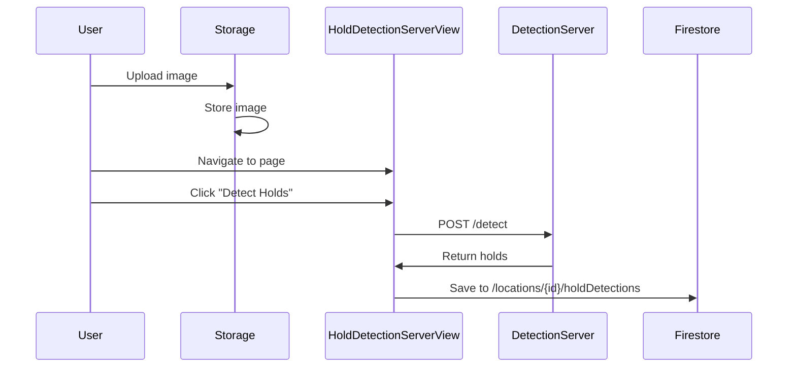
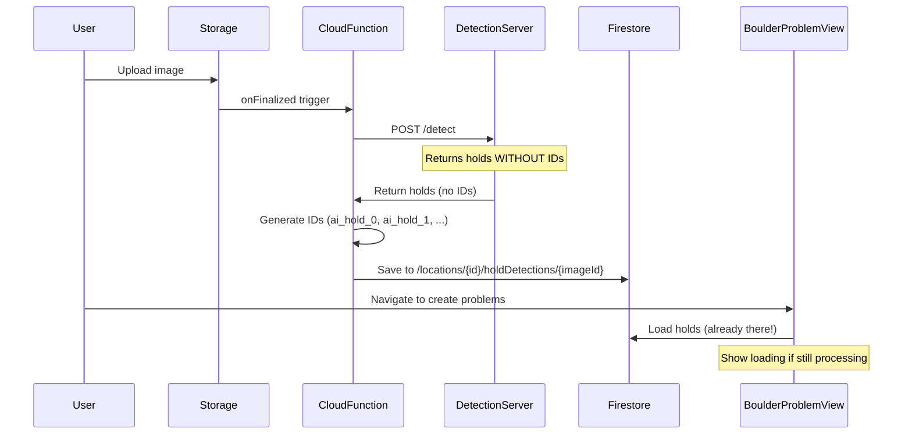

# Automatic Hold Detection Flow

## Overview

**Goal:** Automatically detect holds when a location image is uploaded, eliminating manual detection steps.

## Current Flow (Manual)



**Problems:**
- ❌ Manual step required (user must click "Detect Holds")
- ❌ User must wait on the page for detection to complete
- ❌ No detection if user never visits the holds-server page

## New Flow (Automatic)



**Benefits:**
- ✅ Zero manual steps - detection happens automatically
- ✅ By the time user navigates to create problems, detection is likely done
- ✅ Graceful degradation - show loading state if still processing
- ✅ Consistent - every image gets detected

## Implementation Plan

### 1. Cloud Function: `onLocationImageUploaded`

**File:** `server/src/holdDetection.ts`

**Trigger:** `onObjectFinalized` for path `location-images/{locationId}/{imageId}/*`

**Logic:**
1. Extract `locationId` and `imageId` from file path
2. Get image download URL from Storage
3. Call detection server API with image URL
4. Store results in Firestore at `/locations/{locationId}/holdDetections/{imageId}`
5. Handle errors gracefully (log, update status in Firestore)

**Key Points:**
- Only trigger for `original.*` files (not resized versions)
- Use retry logic for detection server calls
- Store detection status: `pending`, `processing`, `completed`, `failed`

### 2. Update Detection Server API

**Current Endpoint:** `POST /detect`

**Current Behavior:**
- ❌ Returns holds **WITHOUT** IDs
- ❌ Cloud Function must generate IDs (`ai_hold_0`, `ai_hold_1`, etc.)

**Response Includes:**
- ✅ SVG markup for each hold
- ✅ Bounding boxes
- ✅ Confidence scores
- ✅ ViewBox information (maybe - depends on server version)

**Future Improvement:**
- 🎯 Server should generate unique UUIDs for holds
- 🎯 Return holds WITH IDs in response
- 🎯 Eliminates ID generation in Cloud Function

**Current Workaround:**
Cloud Function generates IDs in the format `ai_hold_${index}` to match frontend pattern.

### 3. Update Firestore Schema

**Path:** `/locations/{locationId}/holdDetections/{imageId}`

**Add Status Field:**
```typescript
{
  status: 'pending' | 'processing' | 'completed' | 'failed',
  error?: string,  // If status === 'failed'
  detectionResults: {
    aiHolds: [...],
    metadata: {
      viewBox: string,
      detectedAt: timestamp,
      imageDimensions: { width, height },
      // ... existing fields
    }
  },
  createdAt: timestamp,
  updatedAt: timestamp
}
```

### 4. Update UI Components

#### HoldDetectionServerView.vue

**Changes:**
- Remove "Detect Holds" button (detection is automatic)
- Show status badge: "Detecting holds...", "Ready", "Failed"
- Load from Firestore instead of calling detection server directly
- On failure: Show error message and suggest contacting support

#### BoulderProblemCreation / ImageGallerySimplified

**Changes:**
- Check hold detection status when loading image
- Show loading spinner if `status === 'processing'`
- Show error message if `status === 'failed'` (suggest contacting support)
- Automatically display holds when `status === 'completed'`

### 5. Update Services

#### holdDetectionService.js

**Add Methods:**
```javascript
// Check detection status for an image
async getDetectionStatus(locationId, imageId) {
  const doc = await getDoc(holdDetectionRef(locationId, imageId));
  return doc.data()?.status || 'pending';
}

// Subscribe to detection status changes
onDetectionStatusChange(locationId, imageId, callback) {
  return onSnapshot(holdDetectionRef(locationId, imageId), (doc) => {
    const status = doc.data()?.status || 'pending';
    callback(status, doc.data());
  });
}
```

### 6. Environment Configuration

**Configure in Firestore (single source of truth):**

- Document: `app-config/backend`
- Field: `holdDetection.serverUrl`

You can set it via `/admin/healthcheck` (admin-only) or directly in Firestore Console.

## Implementation Steps

### Phase 1: Cloud Function (Core Feature)
1. ✅ Create `server/src/holdDetection.ts`
2. ✅ Implement `onLocationImageUploaded` trigger
3. ✅ Add detection server API call logic
4. ✅ Store results in Firestore with status
5. ✅ Deploy and test with emulator

### Phase 2: UI Updates (Show Automatic Detection)
1. ✅ Update `holdDetectionService.js` with status methods
2. ✅ Update `HoldDetectionServerView.vue` to show status
3. ✅ Remove manual "Detect Holds" button
4. ✅ Show error message for failures (contact support)
5. ✅ Test with real image uploads

### Phase 3: Loading States (UX Polish)
1. ✅ Add loading spinners when `status === 'processing'`
2. ✅ Add error states when `status === 'failed'` (contact support message)
3. ✅ Test edge cases (slow network, server down)

### Phase 4: Cleanup (Remove Old Code)
1. ✅ Remove manual detection flow from stores
2. ✅ Remove old "Detect Holds" UI
3. ✅ Update documentation
4. ✅ Verify no regressions

## File Changes Summary

### New Files
- `server/src/holdDetection.ts` - Cloud Function for automatic detection

### Modified Files
- `server/src/index.ts` - Export new Cloud Function
- `src/services/holdDetectionService.js` - Add status checking methods
- `src/views/HoldDetectionServerView.vue` - Show status, remove manual button
- `src/components/ImageGallerySimplified.vue` - Show loading/error states
- `firestore.rules` - Add rules for holdDetections status field

## Testing Plan

### Unit Tests
- ✅ Cloud Function extracts locationId/imageId correctly
- ✅ Cloud Function handles detection server errors
- ✅ Status updates propagate to Firestore

### Integration Tests
1. Upload image → verify Cloud Function triggers
2. Wait for detection → verify status changes
3. Check Firestore → verify holds are stored
4. Load UI → verify holds display automatically

### Edge Cases
- ❌ Detection server is down → status 'failed', show error message
- ❌ Invalid image format → should skip gracefully (no detection doc created)
- ❌ Network timeout → Cloud Function retries automatically (Firebase default)
- ✅ Multiple images uploaded quickly → all should process independently
- ⚠️ Failed detections → User contacts support (no automatic retry UI)

## Rollout Strategy

### Stage 1: Feature Flag (Safe Deployment)
- Add `autoDetection: { enabled: false }` to app-config
- Deploy Cloud Function (but keep it disabled)
- Test in development environment

### Stage 2: Gradual Rollout
- Enable auto-detection for new uploads only
- Keep manual detection as fallback
- Monitor Cloud Function logs

### Stage 3: Full Migration
- Enable for all images
- Remove manual detection UI
- Archive old detection code

## Success Metrics

- 📊 Average time from upload to detection complete: < 10 seconds
- 📊 Detection success rate: > 95%
- 📊 User clicks to "Detect Holds" button: 0 (removed)
- 📊 Cloud Function error rate: < 5%

## Future Enhancements

1. **Batch Processing:** Detect holds for multiple images at once
2. **Progressive Enhancement:** Show partial results as detection progresses
3. **Model Versioning:** Track which AI model version was used
4. **Manual Review:** Allow users to approve/reject automatic detections
5. **Confidence Thresholds:** Only save holds above certain confidence level

---

**Status:** 🟡 Ready for Implementation

**Next Steps:**
1. Create `server/src/holdDetection.ts` Cloud Function
2. Test with Firebase emulator
3. Deploy to production
4. Update UI to show automatic detection status
